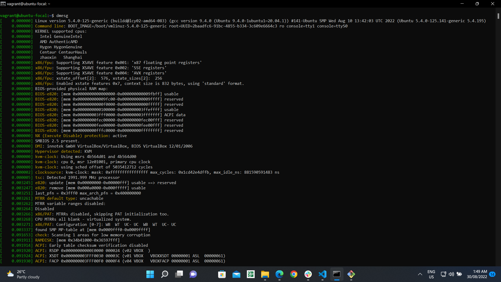
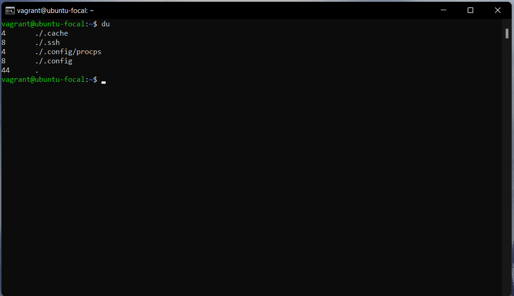
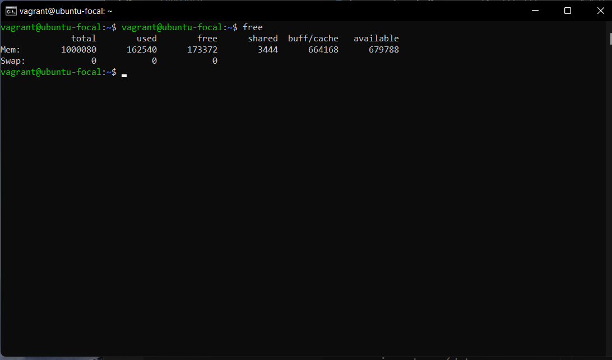
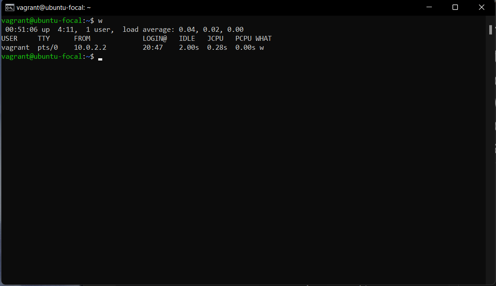
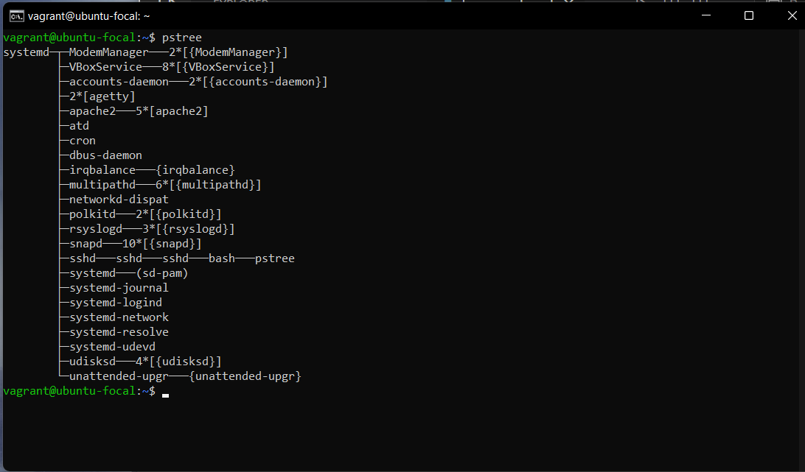
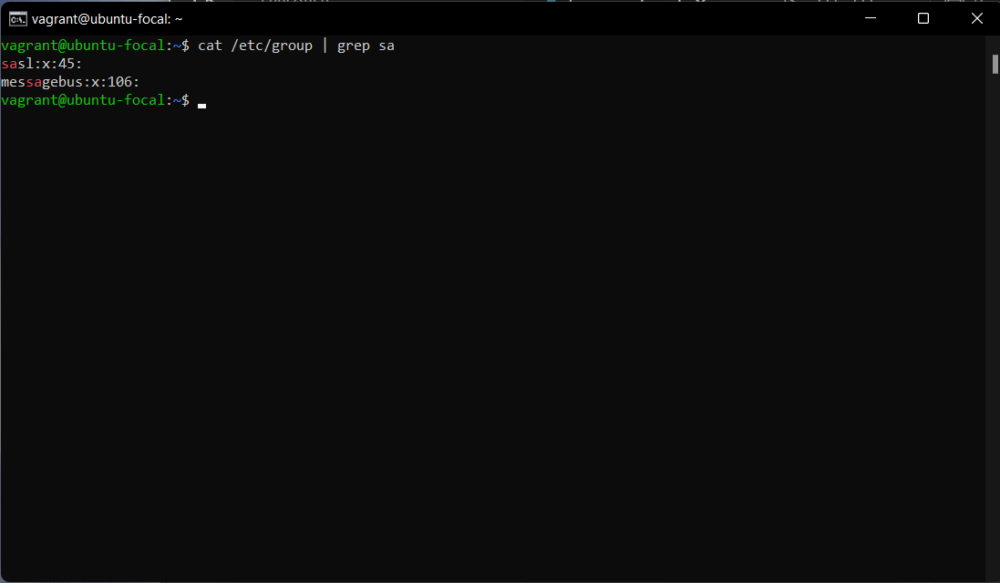
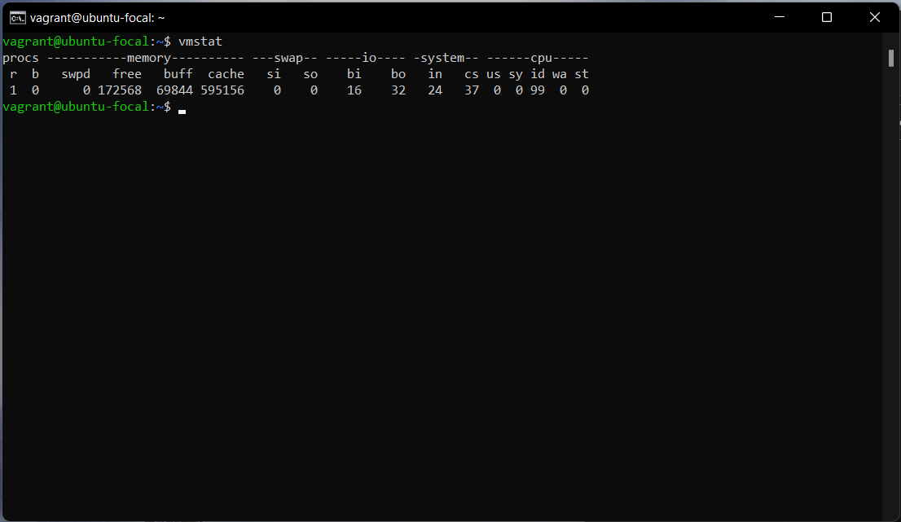
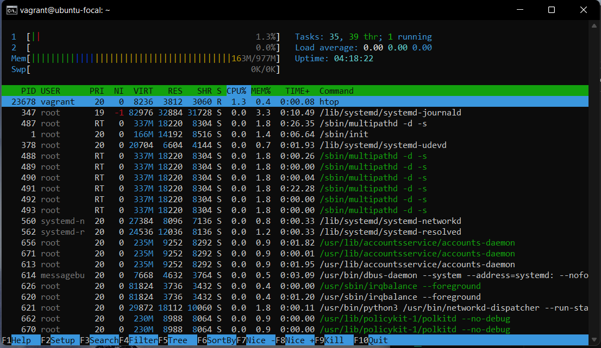
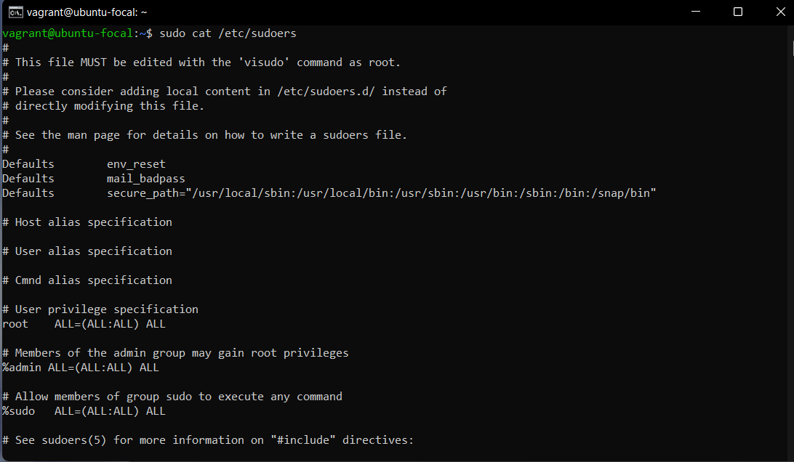
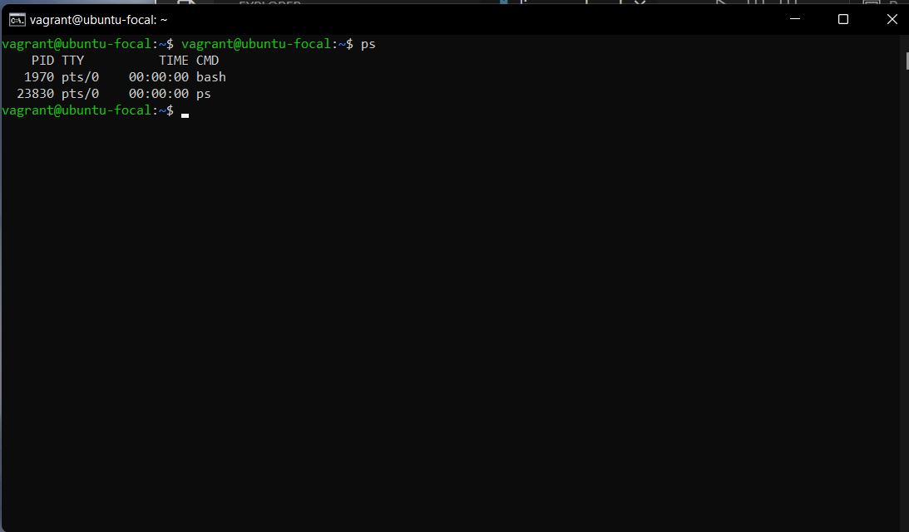

# This is list of ten linux commands with descriptions and examples.

1. `dmesg` – displays the kernel ring's message buffer. 

2. `du` - display a list of all the files along with their respective sizes.

3. `free` - use to get a detailed report on the system's memory usage.

4. `w` – display a list of the currently logged-in user sessions.

5. `pstree` - used to show running processes in a tree (data structure).

6. `grep` - searches a file for a pattern of characters and displays all lines that match.

7. `vmstat` - used to obtain information about memory, system processes, paging, interrupts, block I/O, disk, and CPU scheduling. 

8. `htop` - a process viewer and manager that is interactive.

9. `sudo` - run commands with administrative privileges.

10. `ps` – allows you to list the status of processes running on your system easily.